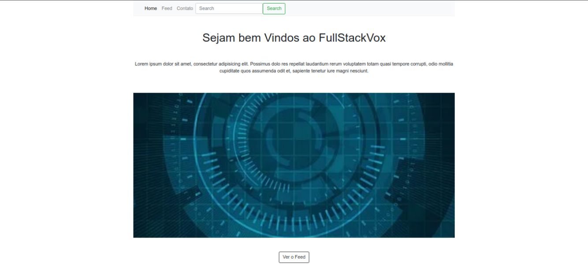
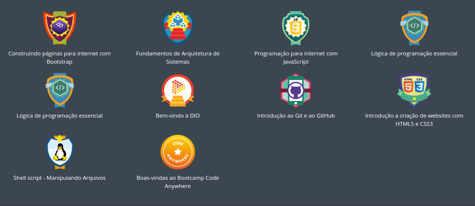

# Labs DIO: Desenvolvimento de um Blog usando Angular e Javascript

Desenvolvimento de um Blog usando Angular e Javascript

# Projeto

Basicamente o projeto tem por foco a criação de um Blog usando Angular. O blog consome dados de um arquivo .json que serve de banco para os dados referentes as postagens do Blog. Estas dados são editados e consumidos pelo Blog. 

Na estrutura do projeto temos dois diretórios que dividem nossa aplicação, os diretórios backend e frontend. Abaixo as características destes dois diretórios:

* backend: Aqui temos o nosso serverjson. Este server quando inicializado permite que tenhamos no ar os dados do nosso arquivo que serve de "banco" da aplicação. Este arquivo é um json que guarda os posts do blog.

* frontend: Aqui temos um Blog todo desenvolvido em Angular e outras tecnologias.

Através da interface do Blog (frontend) temos acesso aos dados do arquivo json (backend). Deste modo podemos não apenas consultar os dados como também incluir e deletar, tudo isso usando os verbos HTTP 

## Conquistas

## Tecnologias
* Angular
* HTML5 / CSS3
* Javascript
* NodeJs
* NPM
* Bootstrap
* Verbos HTTP

## Instrutor(a)

Wheslley Bezerra

## Entidade

Digital Inovation one 

Boot Camp HTML Web Developer - [DIO](https://digitalinnovation.one/sign-up?ref=8EJE9QGVQT)

## Autor
Edson souza

[Linkedin](https://www.linkedin.com/in/edsonfrs/)
[GitHub](https://github.com/Edsonfrs)

